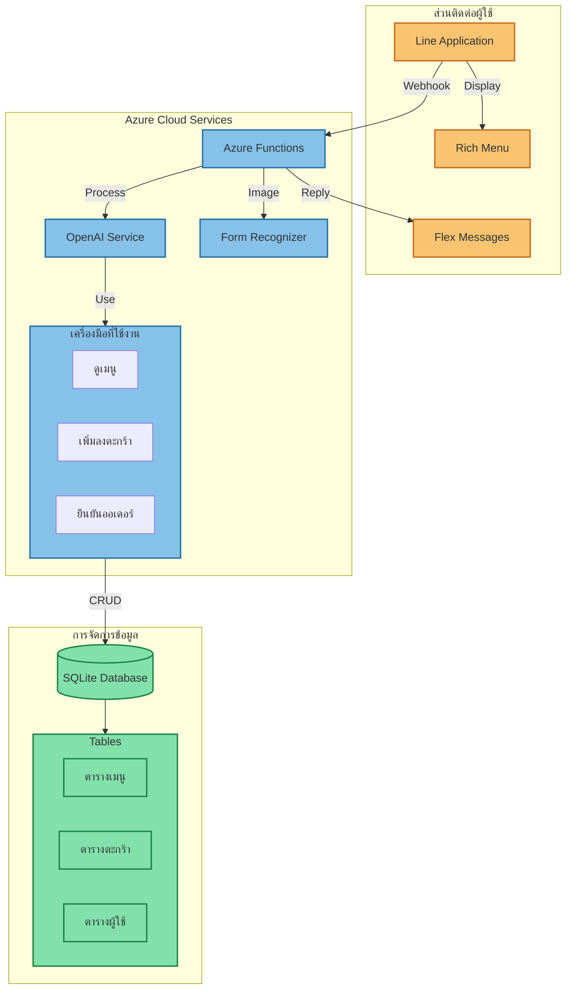

# 📚 สรุปความรู้จากคอร์ส Full Stack & AI Integration

## 🌐 1. พื้นฐาน API และ Azure Functions

### การสร้าง API ด้วย Azure Functions

-   การสร้าง HTTP Triggers
-   การจัดการ Request/Response
-   การใช้งาน async/await
-   การจัดการ error handling

### รูปแบบการเขียน Function

```javascript
app.http("functionName", {
    methods: ["GET", "POST"],
    authLevel: "anonymous",
    handler: async (request, context) => {
        // Function logic
    },
});
```

## 🤖 2. การเชื่อมต่อกับ Azure OpenAI

### การใช้งาน GPT Models

-   การตั้งค่า API Keys และ Endpoint
-   การสร้าง Prompts ที่มีประสิทธิภาพ
-   การจัดการ Response
-   การใช้ Tool Functions

### ตัวอย่าง Tool Functions

```javascript
tools: [
    {
        type: "function",
        function: {
            name: "view_all_food_items",
            description: "ดูรายการอาหารทั้งหมด",
            parameters: {
                /*...*/
            },
        },
    },
];
```

## 💬 3. Line Messaging API

### การพัฒนา Line Bot

-   การสร้าง Webhook
-   การตอบกลับข้อความ
-   การสร้าง Rich Menu
-   การใช้งาน Flex Messages

### การจัดการ Messages

```javascript
async function replyMessage({ messageType, messageText, replyToken }) {
    // Message handling logic
}
```

## 📊 4. ฐานข้อมูลและการจัดการข้อมูล

### SQLite Integration

-   การออกแบบ Schema
-   การจัดการ CRUD Operations
-   การใช้ Queries
-   การจัดการ Transactions

## 📝 5. Form Recognizer

### การประมวลผลเอกสาร

-   การอ่านรูปภาพออเดอร์
-   การแปลงข้อมูลเป็นข้อความ
-   การแมทช์กับรายการในเมนู

## 🔄 6. การรวมระบบเข้าด้วยกัน

### การทำงานร่วมกันของระบบ

1. รับข้อความ/รูปภาพจาก Line
2. ประมวลผลด้วย Azure OpenAI/Form Recognizer
3. จัดการข้อมูลในฐานข้อมูล
4. ตอบกลับผ่าน Line Bot

## 🛠️ 7. เครื่องมือและ Best Practices

### Development Tools

-   VS Code
-   Azure Portal
-   Line Developer Console
-   Postman/Insomnia

### Best Practices

-   การจัดการ Environment Variables
-   Error Handling ที่เหมาะสม
-   การแยก Services
-   การจัดการ Code Structure

## 📱 8. ตัวอย่างการใช้งานจริง

### ระบบร้านอาหาร

-   การจัดการเมนู
-   การรับออเดอร์
-   การจัดการตะกร้าสินค้า
-   การยืนยันคำสั่งซื้อ

### ฟีเจอร์เสริม

-   การรับรูปถ่ายออเดอร์
-   การแนะนำเมนู
-   การติดตามสถานะ
-   การวิเคราะห์ข้อมูล

## 🎯 9. สิ่งที่ได้เรียนรู้เพิ่มเติม

-   การทำงานกับ Cloud Services
-   การจัดการ Authentication/Security
-   การออกแบบ User Experience
-   การ Debug และแก้ไขปัญหา
-   การพัฒนาระบบแบบ Scalable

## 🚀 10. ทักษะที่สามารถนำไปต่อยอด

-   การพัฒนา Chatbot ขั้นสูง
-   การใช้งาน AI Services อื่นๆ
-   การพัฒนาระบบ CRM
-   การสร้าง Business Solutions
-   การทำ System Integration

---


